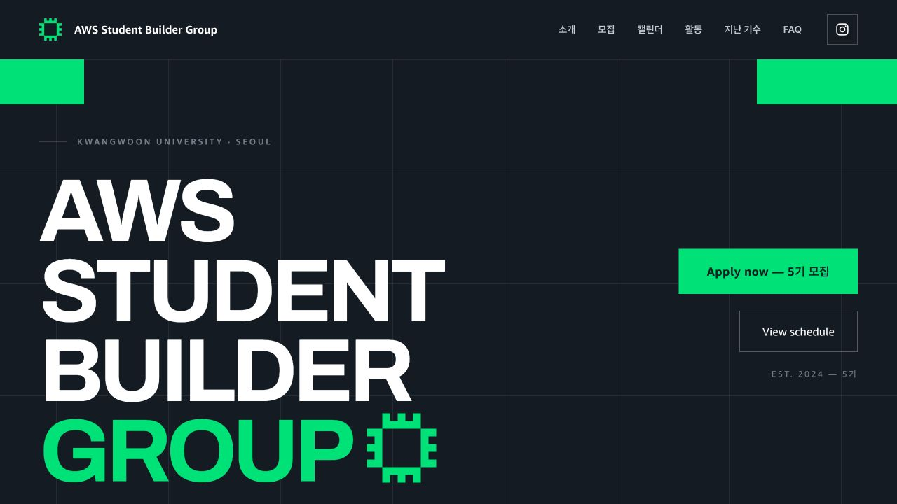

# ASBG KWU

> AWS와 클라우드를 함께 배우고 직접 만들어 보는 광운대학교 AWS Student Builder Group의 공식 홈페이지입니다.

[운영 사이트](https://asbg-kwu.cloud) · [Instagram](https://www.instagram.com/aws.sbg.kwu/) · [5기 지원서](https://tally.so/r/dWGWJr)



## 프로젝트 소개

ASBG KWU는 광운대학교 AWS Student Builder Group의 공식 랜딩 페이지입니다. AWS와 클라우드를 함께 배우고 직접 만들어 보는 학생들의 활동을 소개합니다. 5기 모집 일정과 활동 방식, 지난 기수 기록, 자주 묻는 질문을 한곳에서 확인할 수 있습니다.

한 장의 정적 페이지로 구성했지만, 모집 현황은 서울 시간을 기준으로 자동 표시하고 캘린더·FAQ·기수별 활동 기록은 페이지 안에서 바로 탐색할 수 있습니다.

## 주요 기능

- **리크루팅 안내** — 지원서 작성과 캘린더 열기 버튼, 현재 모집 단계 표시
- **월별 캘린더** — 데스크톱에서는 현재 월과 다음 월을 함께, 작은 화면에서는 한 달씩 표시
- **일정 구분** — 리크루팅 일정은 노랑, 일반 일정은 초록, 공휴일은 회색으로 구분
- **지난 기수 활동** — 1기부터 4기까지의 활동 카드와 사진을 기수별로 탐색
- **FAQ** — 자주 묻는 질문을 펼쳐서 확인하는 아코디언 인터페이스
- **검색·공유 메타데이터** — 제목, 설명, Open Graph, 구조화 데이터, `robots.txt`, `sitemap.xml`, `llms.txt`를 빌드 단계에서 생성

## 기술 구성

| 영역 | 사용 방식 |
| --- | --- |
| 페이지 | 정적 HTML, CSS, JavaScript |
| UI 런타임 | Claude Design 내보내기 런타임과 React UMD |
| 개발 서버 | Python 표준 라이브러리 기반 `serve.py` |
| 빌드 | Python `build.py` |
| 배포 | Cloudflare Pages |


## 로컬 실행

Python 3를 준비하십시오.

```bash
python3 serve.py
```

브라우저에서 [http://localhost:5173](http://localhost:5173)을 여십시오. 다른 포트를 사용하려면 포트 번호를 인자로 넘기십시오.

```bash
python3 serve.py 8080
```


## 빌드

```bash
python3 build.py
```


## 콘텐츠 수정 위치

주요 콘텐츠는 [`AWS Student Builder 웹사이트/ASBG Landing.dc.html`](AWS%20Student%20Builder%20웹사이트/ASBG%20Landing.dc.html) 하단의 데이터와 렌더링 로직에 있습니다.

| 수정 대상 | 위치 |
| --- | --- |
| 기수별 활동 카드 | `const PAST` |
| FAQ | `const FAQS` |
| 리크루팅 단계 | `renderVals()`의 `stepData` |
| 캘린더 일정 | `const CALENDAR_EVENTS` |
| 기수 번호 | `data-props`의 `cohort` |

화면 구조와 스타일도 같은 파일에 있습니다. `support.js`는 Claude Design 런타임 파일이므로 직접 수정하지 마십시오.

## 디렉터리 구조

```text
.
├── AWS Student Builder 웹사이트/
│   ├── ASBG Landing.dc.html  # 페이지 마크업, 스타일, 콘텐츠, 상호작용
│   ├── assets/               # 로고, 아이콘, 폰트, 승인된 활동 사진
│   └── support.js            # Claude Design 런타임
├── docs/images/              # README 스크린샷
├── dist/                     # 배포용 정적 결과물
├── vendor/                   # 로컬 React UMD 파일
├── build.py                  # 배포용 결과물 생성
├── serve.py                  # 로컬 개발 서버
└── wrangler.jsonc            # Cloudflare Pages 설정
```
